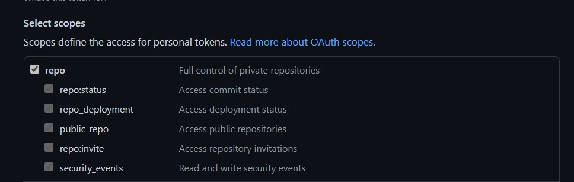

# Fetching Github data

- Generate a new token on Github with access to read repository information
    - [Open the token settings on github](https://github.com/settings/tokens/new)
    - Choose the `repo` scope 
    - Give the token a name & save it, you will need it in the next step

- Create a new file called `credentials.json` that looks like this 

```json
{
    "username":"YOUR_GITHUB_USERNAME",
    "token":"YOUR_TOKEN_FROM_STEP_1"
}
```

- run `python get_github_data.py` and you should have two files created for you
    - one for the repositories you have
    - another for the commits to the repository